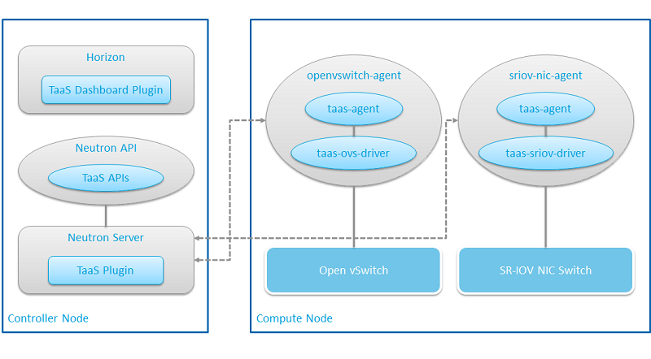

..
 This work is licensed under a Creative Commons Attribution 3.0 Unported
 License.

 http://creativecommons.org/licenses/by/3.0/legalcode

..

==========================================================
Deploy tap-as-a-service (TaaS) Neutron / Dashboard plugin
==========================================================

This guide explains how to deploy tap-as-a-service (TaaS) Neutron plugin and
TaaS Dashboard plugin in Neutron and Horizon charts respectively.

TaaS plugin provides a mechanism to mirror certain traffic (for example tagged
with specific VLANs) from a source VM to any traffic analyzer VM. When packet
will be forwarded, the original value of source and target ip/ports information
will not be altered and the system administrator will be able to run, for ex.
tcpdump, on the target VM to trace these packets.

For more details, refer to TaaS specification: Tap-as-a-service_.

.. _Tap-as-a-service: https://github.com/openstack/tap-as-a-service/blob/master/specs/mitaka/tap-as-a-service.rst

TaaS Architecture
==================

As any other Neutron plugin, TaaS neutron plugin functionality consists of
following modules:

**TaaS Plugin**: This is the front-end of TaaS which runs on controller node
(Neutron server). This serves TaaS APIs and stores/retrieves TaaS configuration
state to/from Neutron TaaS DB.

**TaaS Agent, TaaS OVS Driver and TaaS SR-IOV Driver**: This forms the back-end
of TaaS which runs as a ML2 agent extension on compute nodes. It handles the RPC
calls made by TaaS Plugin and configures the mechanism driver, i.e. OpenVSwitch
or SR-IOV Nic Switch.

**TaaS Dashboard Plugin**: Horizon Plugin which adds GUI panels for TaaS
resources in the Horizon Dashboard.

Prepare LOCI images
======================

Before deploying TaaS and/or TaaS Dashboard, it needs to be added in Neutron
and/or Horizon LOCI images.

This is a two step process, i.e.

#. Prepare a requirements LOCI image with Neutron TaaS and TaaS Dashboard code
   installed.

#. Prepare Neutron or Horizon LOCI image using this requirements image as
   :code:`docker build --build-arg WHEELS` command argument.

Requirements LOCI image
-------------------------

* Create a patchset for ``openstack/requirements`` repo

  Add TaaS and TaaS dashboard dependencies in :code:`upper-constraints.txt`
  file in :code:`openstack/requirements` repo, i.e.
  https://git.openstack.org/openstack/requirements

  .. path upper-constraints
  .. code-block:: none

     git+https://git.openstack.org/openstack/tap-as-a-service@master#egg=tap-as-a-service
     git+https://git.openstack.org/openstack/tap-as-a-service-dashboard@master#egg=tap-as-a-service-dashboard

  .. end

  For example if gerrit refspec for this commit is "refs/changes/xx/xxxxxx/x",
  so export the :code:`REQUIREMENTS_REF_SPEC` variable as follows:

  .. path REQUIREMENTS_REF_SPEC
  .. code-block:: bash

     export REQUIREMENTS_REF_SPEC="refs/changes/xx/xxxxxx/x"

  .. end

* Build the requirements LOCI image using above commit

  Use it as ``docker build --build-arg PROJECT_REF=${REQUIREMENTS_REF_SPEC}``
  command argument to build the requirements LOCI image.

Neutron and Horizon LOCI images
---------------------------------

* Create a patchset for ``openstack/neutron`` repo

  Add TaaS dependency in ``requirements.txt`` file in ``openstack/neutron``
  repo, i.e. https://git.openstack.org/openstack/neutron

  .. path patchset-neutron
  .. code-block:: none

     tap-as-a-service

  .. end

  For example if gerrit refspec for this commit is "refs/changes/xx/xxxxxx/x";
  so export the :code:`NEUTRON_REF_SPEC` variable as follows:

  .. path patchset-neutron-export
  .. code-block:: bash

     export NEUTRON_REF_SPEC="refs/changes/xx/xxxxxx/x"

  .. end

* Create a patchset for ``openstack/horizon`` repo

  Add TaaS Dashboard dependency in ``requirements.txt`` file in
  ``openstack/horizon`` repo, i.e. https://git.openstack.org/openstack/horizon

  .. path patchset-horizon
  .. code-block:: none

     tap-as-a-service-dashboard

  .. end

  For example if gerrit refspec for this commit is "refs/changes/xx/xxxxxx/x";
  so export the :code:`HORIZON_REF_SPEC` variable as follows:

  .. path patchset-horizon-export
  .. code-block:: bash

     export HORIZON_REF_SPEC="refs/changes/xx/xxxxxx/x"

  .. end

* Putting it all together

  Apart from the variables above with gerrit refspec values, additionally
  export following environment variables with values as applicable:

  .. path other-env-export
  .. code-block:: bash

     export OPENSTACK_VERSION="stable/ocata"
     export PRIVATE_REPO="docker.io/username"

  .. end

  Use above gerrit commits to prepare the LOCI images using following script:

  .. path main-script
  .. code-block:: bash

     #!/bin/bash
     set -ex

     # export following variables with applicable values before invoking the script
     #----------
     : ${OPENSTACK_VERSION:="stable/ocata"}
     : ${REQUIREMENTS_REF_SPEC:=""}
     : ${NEUTRON_REF_SPEC:=""}
     : ${HORIZON_REF_SPEC:=""}
     : ${PRIVATE_REPO:="docker.io/username"} # Replace with your own dockerhub repo
     #----------

     IMAGE_TAG="${OPENSTACK_VERSION#*/}"
     REGEX_GERRIT_REF_SPEC="^refs"

     [[ ${REQUIREMENTS_REF_SPEC} =~ ${REGEX_GERRIT_REF_SPEC} ]] ||
     (echo "Please set a proper value for REQUIREMENTS_REF_SPEC env variable" && exit)

     [[ ${NEUTRON_REF_SPEC} =~ ${REGEX_GERRIT_REF_SPEC} ]] ||
     (echo "Please set a proper value for NEUTRON_REF_SPEC env variable" && exit)

     [[ ${HORIZON_REF_SPEC} =~ ${REGEX_GERRIT_REF_SPEC} ]] ||
     (echo "Please set a proper value for HORIZON_REF_SPEC env variable" && exit)

     # Login to private-repo : provide login password when asked
     sudo docker login

     sudo docker run -d \
       --name docker-in-docker \
       --privileged=true \
       --net=host \
       -v /var/lib/docker \
       -v ${HOME}/.docker/config.json:/root/.docker/config.json:ro\
       docker.io/docker:17.07.0-dind \
       dockerd \
         --pidfile=/var/run/docker.pid \
         --host=unix:///var/run/docker.sock \
         --storage-driver=overlay2
     sudo docker exec docker-in-docker apk update
     sudo docker exec docker-in-docker apk add git

     # Prepare Requirements image
     sudo docker exec docker-in-docker docker build --force-rm --pull --no-cache \
         https://git.openstack.org/openstack/loci.git \
         --network host \
         --build-arg FROM=gcr.io/google_containers/ubuntu-slim:0.14 \
         --build-arg PROJECT=requirements \
         --build-arg PROJECT_REF=${REQUIREMENTS_REF_SPEC} \
         --tag ${PRIVATE_REPO}/requirements:${IMAGE_TAG}
     sudo docker exec docker-in-docker docker push ${PRIVATE_REPO}/requirements:${IMAGE_TAG}

     # Prepare Neutron image
     sudo docker exec docker-in-docker docker build --force-rm --pull --no-cache \
     https://git.openstack.org/openstack/loci.git \
     --build-arg PROJECT=neutron \
     --build-arg PROJECT_REF=${NEUTRON_REF_SPEC} \
     --build-arg FROM=gcr.io/google_containers/ubuntu-slim:0.14 \
     --build-arg PROFILES="fluent neutron linuxbridge openvswitch" \
     --build-arg PIP_PACKAGES="pycrypto" \
     --build-arg WHEELS=${PRIVATE_REPO}/requirements:${IMAGE_TAG} \
     --tag ${PRIVATE_REPO}/neutron:${IMAGE_TAG}
     sudo docker exec docker-in-docker docker push ${PRIVATE_REPO}/neutron:${IMAGE_TAG}

     # Prepare Neutron sriov image
     sudo docker exec docker-in-docker docker build --force-rm --pull --no-cache \
     https://git.openstack.org/openstack/loci.git \
     --build-arg PROJECT=neutron \
     --build-arg PROJECT_REF=${NEUTRON_REF_SPEC} \
     --build-arg FROM=docker.io/ubuntu:18.04 \
     --build-arg PROFILES="fluent neutron linuxbridge openvswitch" \
     --build-arg PIP_PACKAGES="pycrypto" \
     --build-arg DIST_PACKAGES="ethtool lshw" \
     --build-arg WHEELS=${PRIVATE_REPO}/requirements:${IMAGE_TAG} \
     --tag ${PRIVATE_REPO}/neutron:${IMAGE_TAG}-sriov-1804
     sudo docker exec docker-in-docker docker push ${PRIVATE_REPO}/neutron:${IMAGE_TAG}-sriov-1804

     # Prepare Horizon image
     sudo docker exec docker-in-docker docker build --force-rm --pull --no-cache \
     https://git.openstack.org/openstack/loci.git \
     --build-arg PROJECT=horizon \
     --build-arg PROJECT_REF=${HORIZON_REF_SPEC} \
     --build-arg FROM=gcr.io/google_containers/ubuntu-slim:0.14 \
     --build-arg PROFILES="fluent horizon apache" \
     --build-arg PIP_PACKAGES="pycrypto" \
     --build-arg WHEELS=${PRIVATE_REPO}/requirements:${IMAGE_TAG} \
     --tag ${PRIVATE_REPO}/horizon:${IMAGE_TAG}
     sudo docker exec docker-in-docker docker push ${PRIVATE_REPO}/horizon:${IMAGE_TAG}

  .. end

Deploy TaaS Plugin
==================

Override images in Neutron chart
---------------------------------

Override the :code:`images` section parameters for Neutron chart with the
custom LOCI image's tag, prepared as explained in above sections.

.. code-block:: yaml

    images:
      tags:
        neutron_db_sync: ${PRIVATE_REPO}/neutron:ocata
        neutron_server: ${PRIVATE_REPO}/neutron:ocata
        neutron_dhcp: ${PRIVATE_REPO}/neutron:ocata
        neutron_metadata: ${PRIVATE_REPO}/neutron:ocata
        neutron_l3: ${PRIVATE_REPO}/neutron:ocata
        neutron_openvswitch_agent: ${PRIVATE_REPO}/neutron:ocata
        neutron_linuxbridge_agent: ${PRIVATE_REPO}/neutron:ocata
        neutron_sriov_agent: ${PRIVATE_REPO}/neutron:ocata-sriov-1804
        neutron_sriov_agent_init: ${PRIVATE_REPO}/neutron:ocata-sriov-1804

Configure TaaS in Neutron chart
--------------------------------

While deploying neutron-server and L2 agents, TaaS should be enabled in
``conf: neutron`` section to add TaaS as a service plugin; in ``conf: plugins``
section to add TaaS as a L2 agent extension; in ``conf: taas_plugin`` section
to configure the ``service_provider`` endpoint used by Neutron TaaS plugin:

.. code-block:: yaml

    conf:
      neutron:
        DEFAULT:
          service_plugins: taas
      plugins:
        ml2_conf:
          agent:
            extensions: taas
        taas:
          taas:
            enabled: True
      taas_plugin:
        service_providers:
          service_provider: TAAS:TAAS:neutron_taas.services.taas.service_drivers.taas_rpc.TaasRpcDriver:default

Deploy TaaS Dashboard Plugin
============================

TaaS dashboard plugin can be deployed simply by using custom LOCI images having
TaaS Dashboard code installed (as explained in above sections), i.e. override
the :code:`images` section parameters for Horizon charts:

.. code-block:: yaml

    images:
      tags:
        horizon_db_sync: ${PRIVATE_REPO}/horizon:ocata
        horizon: ${PRIVATE_REPO}/horizon:ocata

Set log level for TaaS
======================

Default log level for Neutron TaaS is :code:`INFO`. For changing it, override
following parameter:

.. code-block:: yaml

    conf:
      logging:
        logger_neutron_taas:
          level: INFO

References
==========
#. Neutron TaaS support in Openstack-Helm commits:

   -  https://review.openstack.org/#/c/597200/
   -  https://review.openstack.org/#/c/607392/

#. Add TaaS panel to Horizon Dashboard:

   -  https://review.openstack.org/#/c/621606/
