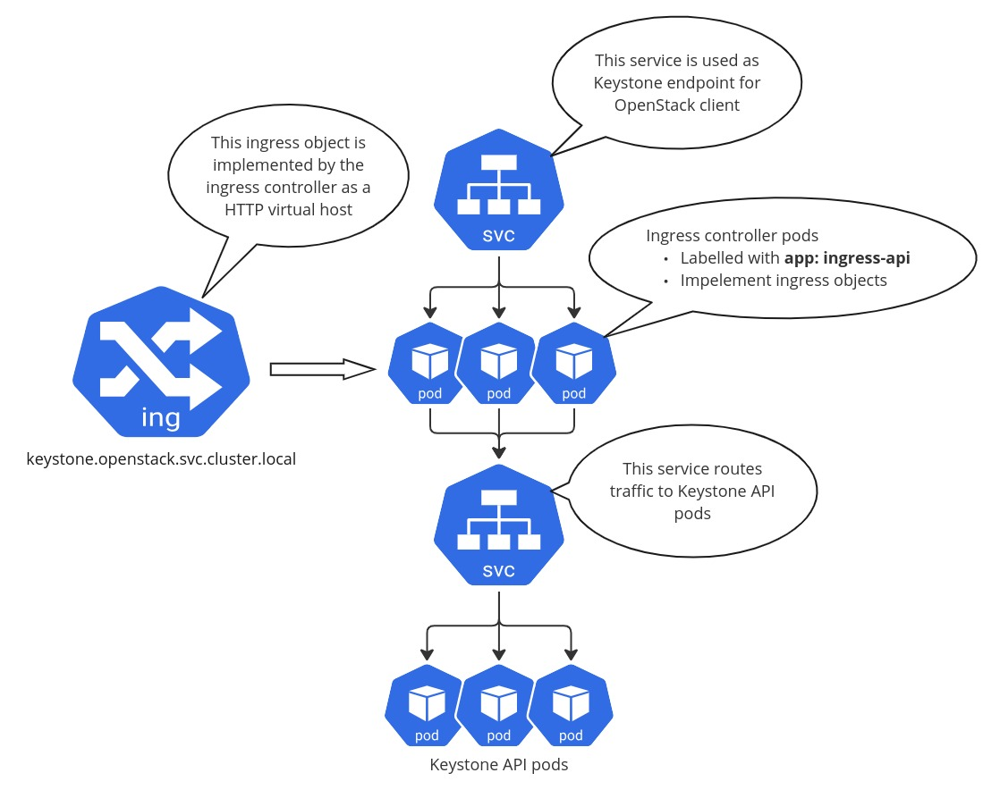

Kubernetes prerequisites
========================

Ingress controller
------------------

Ingress controller when deploying OpenStack on Kubernetes
is essential to ensure proper external access for the OpenStack services.

We recommend using the `ingress-nginx`_ because it is simple and provides
all necessary features. It utilizes Nginx as a reverse proxy backend.
Here is how to deploy it.

First, let's create a namespace for the OpenStack workloads. The ingress
controller must be deployed in the same namespace because OpenStack-Helm charts
create service resources pointing to the ingress controller pods which
in turn redirect traffic to particular Openstack API pods.

.. code-block:: bash

    tee > /tmp/openstack_namespace.yaml <<EOF
    apiVersion: v1
    kind: Namespace
    metadata:
      name: openstack
    EOF
    kubectl apply -f /tmp/openstack_namespace.yaml

Next, deploy the ingress controller in the ``openstack`` namespace:

.. code-block:: bash

    helm repo add ingress-nginx https://kubernetes.github.io/ingress-nginx
    helm upgrade --install ingress-nginx ingress-nginx/ingress-nginx \
        --version="4.8.3" \
        --namespace=openstack \
        --set controller.kind=Deployment \
        --set controller.admissionWebhooks.enabled="false" \
        --set controller.scope.enabled="true" \
        --set controller.service.enabled="false" \
        --set controller.ingressClassResource.name=nginx \
        --set controller.ingressClassResource.controllerValue="k8s.io/ingress-nginx" \
        --set controller.ingressClassResource.default="false" \
        --set controller.ingressClass=nginx \
        --set controller.labels.app=ingress-api

You can deploy any other ingress controller that suits your needs best.
See for example the list of available `ingress controllers`_.
Ensure that the ingress controller pods are deployed with the ``app: ingress-api``
label which is used by the OpenStack-Helm as a selector for the Kubernetes
service resources.

For example, the OpenStack-Helm ``keystone`` chart by default creates a service
that redirects traffic to the ingress controller pods selected using the
``app: ingress-api`` label. Then it also creates an ``Ingress`` resource which
the ingress controller then uses to configure its reverse proxy
backend (Nginx) which eventually routes the traffic to the Keystone API
service which works as an endpoint for Keystone API pods.

.. note::
    For exposing the OpenStack services to the external world, we can a create
    service of type ``LoadBalancer`` or ``NodePort`` with the selector pointing to
    the ingress controller pods.

.. _ingress-nginx: https://github.com/kubernetes/ingress-nginx/blob/main/charts/ingress-nginx/README.md
.. _ingress controllers: https://kubernetes.io/docs/concepts/services-networking/ingress-controllers/

MetalLB
-------

MetalLB is a load-balancer for bare metal Kubernetes clusters levereging
L2/L3 protocols. This is a popular way of exposing the web
applications running in Kubernetes to the external world.

The following commands can be used to deploy MetalLB:

.. code-block:: bash

    tee > /tmp/metallb_system_namespace.yaml <<EOF
    apiVersion: v1
    kind: Namespace
    metadata:
      name: metallb-system
    EOF
    kubectl apply -f /tmp/metallb_system_namespace.yaml

    helm repo add metallb https://metallb.github.io/metallb
    helm install metallb metallb/metallb -n metallb-system

Now it is necessary to configure the MetalLB IP address pool and the IP address
advertisement. The MetalLB custom resources are used for this:

.. code-block:: bash

    tee > /tmp/metallb_ipaddresspool.yaml <<EOF
    ---
    apiVersion: metallb.io/v1beta1
    kind: IPAddressPool
    metadata:
        name: public
        namespace: metallb-system
    spec:
        addresses:
        - "172.24.128.0/24"
    EOF

    kubectl apply -f /tmp/metallb_ipaddresspool.yaml

    tee > /tmp/metallb_l2advertisement.yaml <<EOF
    ---
    apiVersion: metallb.io/v1beta1
    kind: L2Advertisement
    metadata:
        name: public
        namespace: metallb-system
    spec:
        ipAddressPools:
        - public
    EOF

    kubectl apply -f /tmp/metallb_l2advertisement.yaml

Next, let's create a service of type ``LoadBalancer`` which will the
public endpoint for all OpenStack services that we will later deploy.
The MetalLB will assign an IP address to it (we can assinged a dedicated
IP using annotations):

.. code-block:: bash

    tee > /tmp/openstack_endpoint_service.yaml <<EOF
    ---
    kind: Service
    apiVersion: v1
    metadata:
      name: public-openstack
      namespace: openstack
      annotations:
        metallb.universe.tf/loadBalancerIPs: "172.24.128.100"
    spec:
      externalTrafficPolicy: Cluster
      type: LoadBalancer
      selector:
        app: ingress-api
      ports:
        - name: http
          port: 80
        - name: https
          port: 443
    EOF

    kubectl apply -f /tmp/openstack_endpoint_service.yaml

This service will redirect the traffic to the ingress controller pods
(see the ``app: ingress-api`` selector). OpenStack-Helm charts create
``Ingress`` resources which are used by the ingress controller to configure the
reverse proxy backend so that the traffic eventually goes to particular
Openstack API pods.

By default, the ``Ingress`` objects will only contain rules for the
``openstack.svc.cluster.local`` DNS domain. This is the internal Kubernetes domain
and it is not supposed to be used outside the cluster.

You can use the ``host_fqdn_override`` for the endpoints to set an alternate
hostname using a service like `sslip.io`_. Assuming your services are exposed
at ``172.24.128.100`` as is referenced in the Service above, you could use
``<service>.172-24-128-100.sslip.io``

Here is an example of how to set the ``host_fqdn_override`` for the Keystone chart:

.. code-block:: yaml

    endpoints:
      identity:
        host_fqdn_override:
          public:
            host: "keystone.172-24-128-100.sslip.io"

.. note::
    In production environments you probably choose to use a different DNS
    domain for public OpenStack endpoints. This is easy to achieve by setting
    the necessary chart values. All Openstack-Helm charts values have the
    ``endpoints`` section where you can specify the ``host_fqdn_override``.
    In this case a chart will create additional ``Ingress`` resources to
    handle the external domain name and also the Keystone endpoint catalog
    will be updated.

.. _sslip.io: https://sslip.io/

Ceph
----

Ceph is a highly scalable and fault-tolerant distributed storage
system. It offers object storage, block storage, and
file storage capabilities, making it a versatile solution for
various storage needs.

Kubernetes CSI (Container Storage Interface) allows storage providers
like Ceph to implement their drivers, so that Kubernetes can
use the CSI driver to provision and manage volumes which can be
used by stateful applications deployed on top of Kubernetes
to store their data. In the context of OpenStack running in Kubernetes,
the Ceph is used as a storage backend for services like MariaDB, RabbitMQ and
other services that require persistent storage. By default OpenStack-Helm
stateful sets expect to find a storage class named **general**.

At the same time, Ceph provides the RBD API, which applications
can utilize directly to create and mount block devices distributed across
the Ceph cluster. For example the OpenStack Cinder utilizes this Ceph
capability to offer persistent block devices to virtual machines
managed by the OpenStack Nova.

The recommended way to manage Ceph on top of Kubernetes is by means
of the `Rook`_ operator. The Rook project provides the Helm chart
to deploy the Rook operator which extends the Kubernetes API
adding CRDs that enable managing Ceph clusters via Kuberntes custom objects.
There is also another Helm chart that facilitates deploying Ceph clusters
using Rook custom resources.

For details please refer to the `Rook`_ documentation and the `charts`_.

.. note::
    The following script `ceph-rook.sh`_ (recommended for testing only) can be used as
    an example of how to deploy the Rook Ceph operator and a Ceph cluster using the
    Rook `charts`_. Please note that the script places Ceph OSDs on loopback devices
    which is **not recommended** for production. The loopback devices must exist before
    using this script.

Once the Ceph cluster is deployed, the next step is to enable using it
for services depoyed by OpenStack-Helm charts. The ``ceph-adapter-rook`` chart
provides the necessary functionality to do this. The chart will
prepare Kubernetes secret resources containing Ceph client keys/configs
that are later used to interface with the Ceph cluster.

Here we assume the Ceph cluster is deployed in the ``ceph`` namespace.

.. code-block:: bash

    helm upgrade --install ceph-adapter-rook openstack-helm-infra/ceph-adapter-rook \
        --namespace=openstack

    helm osh wait-for-pods openstack

.. _Rook: https://rook.io/
.. _charts: https://rook.io/docs/rook/latest-release/Helm-Charts/helm-charts/
.. _ceph-rook.sh: https://opendev.org/openstack/openstack-helm-infra/src/branch/master/tools/deployment/ceph/ceph-rook.sh

Node labels
-----------

Openstack-Helm charts rely on Kubernetes node labels to determine which nodes
are suitable for running specific OpenStack components.

The following sets labels on all the Kubernetes nodes in the cluster
including control plane nodes but you can choose to label only a subset of nodes
where you want to run OpenStack:

.. code-block::

    kubectl label --overwrite nodes --all openstack-control-plane=enabled
    kubectl label --overwrite nodes --all openstack-compute-node=enabled
    kubectl label --overwrite nodes --all openvswitch=enabled
    kubectl label --overwrite nodes --all linuxbridge=enabled

.. note::
    The control plane nodes are tainted by default to prevent scheduling
    of pods on them. You can untaint the control plane nodes using the following command:

.. code-block:: bash

    kubectl taint nodes -l 'node-role.kubernetes.io/control-plane' node-role.kubernetes.io/control-plane-
